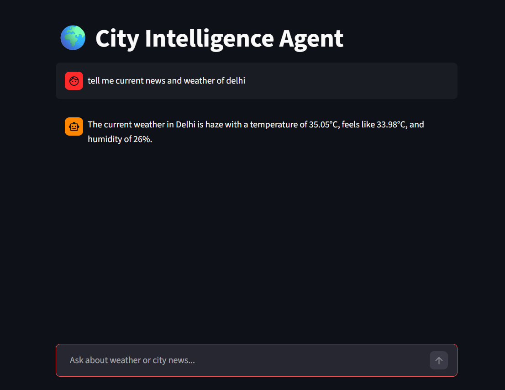

# 🌍 City Intelligence AI Agent

An AI-powered City Intelligence Assistant built using **LangChain**, **Groq LLM**, **Streamlit**, **OpenWeather API**, and **Tavily Search API**.

This project can:

* 🌤️ Get real-time weather information
* 📰 Fetch latest city news
* 🤖 Use AI tool-calling with LangChain agents
* 🌐 Run as a deployed web application

---

# 🚀 Features

* AI Tool Calling Agent
* Weather API Integration
* News Search Integration
* Streamlit Chat UI
* Conversation Memory
* Human-like AI Responses
* Deployable on Render/Railway

---

# 🛠️ Tech Stack

| Technology      | Usage           |
| --------------- | --------------- |
| Python          | Backend         |
| LangChain       | Agent Framework |
| Groq            | LLM Provider    |
| Streamlit       | Frontend UI     |
| Tavily API      | News Search     |
| OpenWeather API | Weather Data    |

---

# 📁 Project Structure

```bash
WeatherAndNewsAgent/
│
├── agent_core.py
├── streamlit_app.py
├── requirements.txt
├── runtime.txt
├── .gitignore
├── .env
└── README.md
```

---

# ⚙️ Setup Instructions

# 1️⃣ Clone Repository

```bash
git clone YOUR_GITHUB_REPO_URL
cd WeatherAndNewsAgent
```

---

# 2️⃣ Create Virtual Environment

## Windows

```bash
python -m venv .venv
.venv\Scripts\activate
```

## Mac/Linux

```bash
python3 -m venv .venv
source .venv/bin/activate
```

---

# 3️⃣ Install Dependencies

```bash
pip install -r requirements.txt
```

---

# 4️⃣ Create `.env` File

Create a `.env` file in the root directory.

```env
OPEN_WEATHER_API_KEY=your_openweather_api_key
TAVILY_API_KEY=your_tavily_api_key
GROQ_API_KEY=your_groq_api_key
```

---

# 🔑 API Keys Setup

## OpenWeather API

1. Visit:
   https://openweathermap.org/api

2. Create account

3. Generate API Key

---

## Tavily API

1. Visit:
   https://tavily.com

2. Create account

3. Generate API Key

---

## Groq API

1. Visit:
   https://console.groq.com

2. Generate API Key

---

# ▶️ Run the Project

```bash
streamlit run streamlit_app.py
```

Application will start at:

```bash
http://localhost:8501
```

---

# 🧠 How It Works

# Flow

```text
User Input
   ↓
Groq LLM
   ↓
Tool Calling Decision
   ↓
Weather / News Tool Execution
   ↓
Tool Result
   ↓
Final AI Response
```

---

# 🧰 Tools Used

## 🌤️ Weather Tool

Uses OpenWeather API to fetch:

* Temperature
* Weather Condition
* Humidity
* Feels Like

---

## 📰 News Tool

Uses Tavily Search API to fetch:

* Latest city news
* Headlines
* News summaries
* Source URLs

---

# 📦 requirements.txt

```txt
streamlit
langchain
langchain-core
langchain-groq
tavily-python
python-dotenv
requests
groq
```

---

# 🌐 Deployment (Render)

# 1️⃣ Push Code to GitHub

```bash
git init
git add .
git commit -m "Initial Commit"
git push
```

---

# 2️⃣ Create Render Web Service

Visit:

https://render.com

---

# 3️⃣ Configure

## Build Command

```bash
pip install -r requirements.txt
```

## Start Command

```bash
streamlit run streamlit_app.py --server.port=$PORT --server.address=0.0.0.0
```

---

# 4️⃣ Add Environment Variables

Add these in Render dashboard:

```env
OPEN_WEATHER_API_KEY=xxxx
TAVILY_API_KEY=xxxx
GROQ_API_KEY=xxxx
```

---

# 📸 Demo



---
# 🌐 Live Demo

The project is successfully deployed and accessible online.

## 🚀 Try the Live App

🔗 https://weatherandnewsagent.onrender.com/

You can:

* Ask for real-time weather updates
* Get latest city news
* Interact with the AI agent directly from the browser

Example Queries:

```text
What's the weather in Delhi?
```

```text
Latest news about Mumbai
```

```text
Tell me weather and news for Bangalore
```


# 🔮 Future Improvements

* Voice Assistant
* Multi-Agent System
* Database Memory
* User Authentication
* Travel Recommendations
* Live Maps Integration
* Chat History Persistence

---

# 🤝 Contributing

Contributions are welcome.

Feel free to fork the project and submit pull requests.

---

# 📄 License

MIT License

---

# 👨‍💻 Author

Developed by Vishal 🚀
